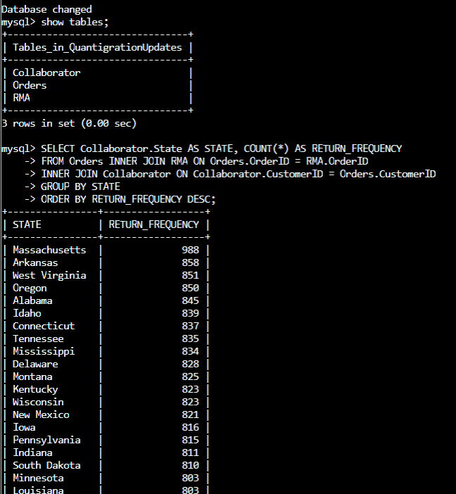
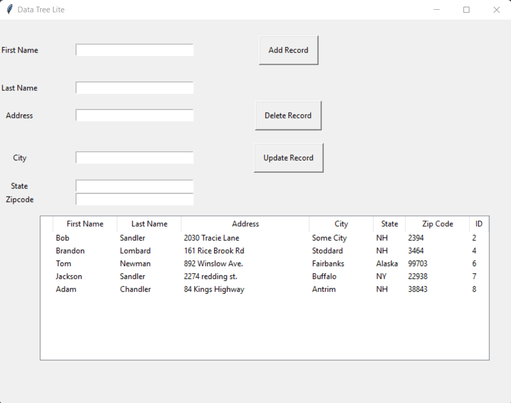
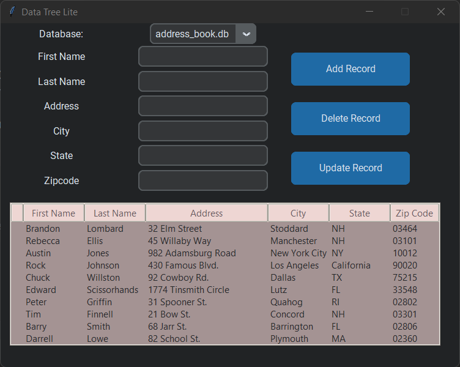

# <pre align="center">Enhancement Three: Databases</pre>

## <pre align="center">Database Program</pre>

Located in the **DataTreeLite** Folder

 The artifact I’ve chosen to enhance is a <code>MySQL database</code> from the <code>DAD-220</code> course. This project entailed adding, updating, deleting, and pulling information from a database. This was done using SQL, which required a command line interface to perform these functions. I chose to enhance this project by adding a user interface with Python and obtaining that data using SQLite. This was a fun and rewarding project, as when I first started it I had little to no idea how SQLite and Python worked together.  It started out rough, where I was conducting a lot of research how to use SQLite in Python, but after some time I got used to it and was able to add almost all the features that I would like in this program. I used the “tkinter” module to create the basic GUI, then used customtkinter to give it the dark theme.
 
I had several issues when making this project. I started out small, creating a very basic program that output the database items in a label for the user to see, and they had to press a button to update the items every time they opened the program or made changes to the database. I quickly discovered that this isn’t ideal, while a live view of the database would be much more idea. Therefore, I added a treeview feature where the user can select and update items easily in their program. There were multiple issues with creating this treeview that worked with the SQL data, such as updating properly, and transferring data back and forth between the tree and the database. I decided to require the database to update automatically after making changes. I also made it so that if the user double clicks an option on the treeview that it auto-populates in the textboxes so the user can make quick changes. 

I have met multiple program outcomes with this project, to include, “Demonstrate an ability to use well-founded and innovative techniques, skills, and tools in computing practices for the purpose of implementing computer solutions that deliver value and accomplish industry-specific goals (software engineering/design/database).” I was able to do this by creating innovative functions, such as the live view editing of the database. I also have met the following outcome: “Develop a security mindset that anticipates adversarial exploits in software architecture and designs to expose potential vulnerabilities, mitigate design flaws, and ensure privacy and enhanced security of data and resources.” Having a secure program is highly important, especially when working with data. A company could be holding customer information and would not want that data to be stolen. To improve my current program’s security, I have incorporated _________________.

Overall, this was a great learning experience for me and was cool to see the enhancements that were possible in this project. I have learned a lot about SQLite and how to make basic Python GUIs in the process. Overall, I still have work to do on the GUI and functionality of the program, to include possibly implementing Object-oriented techniques. I feel as though instead of using global variables as I did, using classes and OOP would be much more efficient and easier to read.

### <pre align="center">Future Updates to this artifact</pre>

There are multiple enhancements I plan to do in the future for this artifact. First, I'd like to convert this project to Object-Oriented Programming techniques by using classes instead of global variables. Secondly, I want this program to have the capability to use differnet databases which contain different data. Right now, you can use multiple databases as long as they have the same type of data stored. 

### <pre align="center">Original Project</pre>

### <pre align="center">Second Design</pre>

### <pre align="center">Final Design</pre>

