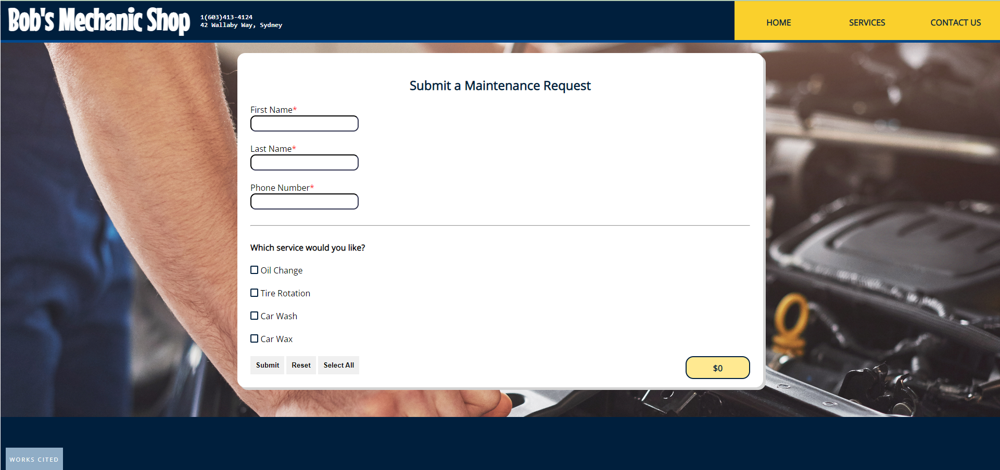
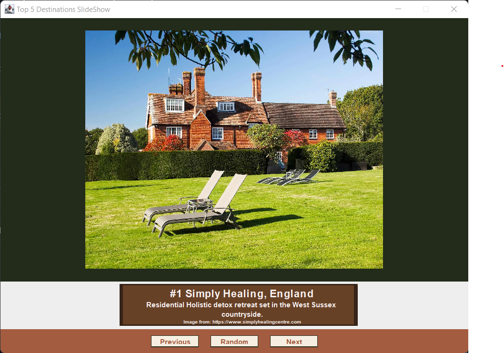

  

  
# Computer Science Capstone
  
## 
CS-499 | SNHU

#### CODE REVIEW

A code review involves quality assurance on a particular project by reviewing its source code and output. This is highly important to the success of computer science professionals, since it ensures a level of consistency in the development of a project and allows for a higher level of coding standards to be met. 

<code>You can watch the code review <a href="https://www.brandonlombard.com/CS-499/code-review.html">here</a>.</code>

#### Project 1: Software Engineering and Design

The first artifact of this portfolio is a Mehanic Service Order Website, where customers can fill out a form with their chosen services and see the total cost. This is an example of my full stack capabilities.

  

  
<code>See the artifact's report and code <a href="https://github.com/BrandonLombard/BrandonLombard.github.io/tree/Mechanic-Website">here</a>.</code>

#### Project 2: Algorithm and Data Structures

This project is a vacation destination slide show that was written in Java. It displays my knowledge of Object Oriented Programming, along with the implementation of design aspects.

  

  
<code>See the artifact's report and code <a href="https://github.com/BrandonLombard/BrandonLombard.github.io/tree/Java-Slide-Show">here</a>.</code>

#### Project 3: Databases

My database project uses Python and SQLite _______.

  

  <code>See the artifact's report and code <a href="">here</a>.</code>

## Professional Self-Assessment

