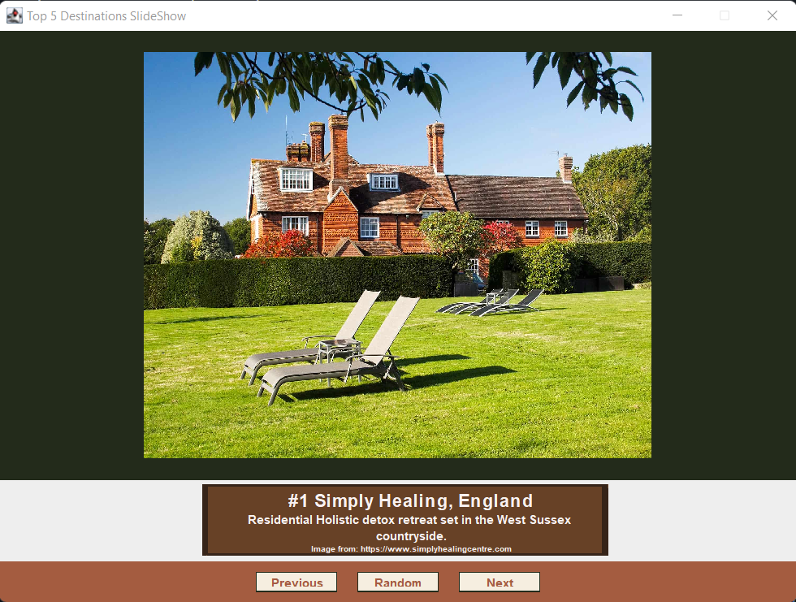

  
# Computer Science Capstone
  
## 
CS-499 | SNHU

#### CODE REVIEW

A code review involves quality assurance on a particular project by reviewing its source code and output. This is highly important to the success of computer science professionals, since it ensures a level of consistency in the development of a project and allows for a higher level of coding standards to be met. 

You can view this <a href="https://www.brandonlombard.com/CS-499/code-review.html">here</a>.

#### Project 1: Software Engineering and Design

The first artifact of this portfolio is a Mehanic Service Order Website, where customers can fill out a form with their chosen services and see the total cost.

Click <a href="https://github.com/BrandonLombard/BrandonLombard.github.io/tree/Mechanic-Website">here</a> to view this project.

#### Project 2: Algorithm and Data Structures

This project is a vacation destination slide show that was written in Java. It displays my knowledge of Object Oriented Programming, along with the implementation of design aspects.

Click <a href="https://github.com/BrandonLombard/BrandonLombard.github.io/tree/Java-Slide-Show">here</a> to view this project.

#### Project 3: Databases

My database project uses Python and SQLite _______.

Click <a href="">here</a> to view this project.

## Professional Self-Assessment

